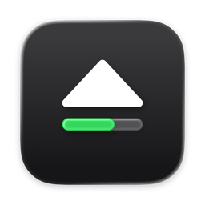
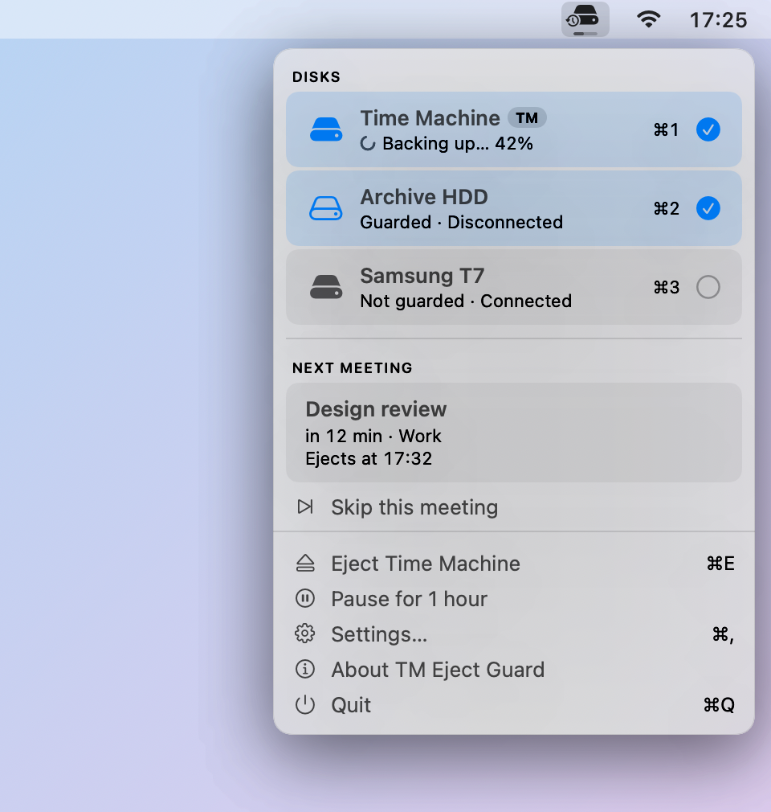

<p align="center"></p>

<h1 align="center">TM Eject Guard</h1>

**Never unplug a mounted backup disk again.** TM Eject Guard is a small macOS
menu bar app that ejects your external disks a few minutes before a meeting
starts, so you can grab the laptop and go.

<p align="center">
  <picture>
    <source media="(prefers-color-scheme: dark)" srcset="docs/popover-dark.png">
    
  </picture>
</p>

You head to a meeting, pull the laptop off the desk, and only remember the
Time Machine drive once the cable is already out. On a spinning HDD, especially
mid-backup, that is how backups get corrupted. TM Eject Guard remembers for you.

## What it does

- **Ejects on time.** Five minutes before a real meeting (you choose the lead
  time), your guarded disks are ejected and you get a notification.
- **Knows a meeting from a calendar block.** Only timed events with other
  attendees count, so `Focus` or `Lunch` never trigger it. Declined and
  cancelled events are ignored.
- **Takes care of Time Machine.** A running backup to that disk is stopped
  cleanly first. Backups to other destinations keep going.
- **Shows backup progress** in the menu bar icon while Time Machine writes to a
  guarded disk.
- **Stays out of your way.** Skip a single meeting, pause for an hour, eject
  now with ⌘E, or eject when the Mac goes to sleep.
- **Tells you when it cannot eject**, and names the app holding the disk, so
  you know not to pull the cable.

It works in English, Slovak, Czech and German, and updates itself.

## Install

1. Download `TM-Eject-Guard-<version>.zip` from the
   [latest release](https://github.com/m-moravcik/tm-eject-guard/releases/latest).
2. Unzip it and move **TM Eject Guard** to Applications.
3. Open it and allow Calendar access.
4. Click the menu bar icon and tick the disks to guard.

Turn on **Launch at login** in Settings so it survives a restart. The app is
signed and notarized by Apple and requires macOS 14 or newer.

## Using it

The menu bar popover shows your disks and today's next meeting:

- **Click a disk** to guard it. Disks are remembered once you plug them in,
  and Time Machine destinations appear straight away. ⌘1 to ⌘9 toggle them
  from the keyboard.
- **Next meeting** shows what the guard will do and when it will eject.
  **Skip this meeting** leaves your disks alone for that one event.
- **Eject now**, **Pause** and **Settings** sit at the bottom.

In Settings you can change the lead time, count any timed event as a meeting,
ignore events marked *Free*, limit it to specific calendars, and enable ejecting
on sleep.

## Safe by design

- Only external, ejectable disks you ticked are ever touched. The startup disk
  cannot be ejected by any code path.
- Disks are recognised by their volume UUID, not by name.
- Nothing leaves your Mac. The calendar is read locally, and the app talks to
  the network only to check for updates.
- The log names your meetings, so it is readable by you alone.

Good to know: like Finder, it ejects the whole physical disk, including its
other volumes. An encrypted Time Machine disk has to be unplugged and plugged
back in to use it again.

## Command line

An optional CLI, `tm-eject-guard`, is installed by `./install.sh` from source.
It is handy for setup and debugging:

```sh
tm-eject-guard                # disks, selection, next meeting
tm-eject-guard --watch "WD"   # guard a disk
tm-eject-guard --dry-run      # run a pass without ejecting
tm-eject-guard --eject-now    # eject guarded disks now
tm-eject-guard --help         # everything else
```

Settings live in `~/Library/Application Support/TMEjectGuard/config.json` and
the log in `~/Library/Logs/tm-eject-guard.log`.

## Building from source

```sh
./install.sh     # build, install to /Applications and ~/bin, launch
./uninstall.sh   # remove, keeping config and log
```

How it works inside, testing, and releasing: [DEVELOPMENT.md](DEVELOPMENT.md).

## License

[MIT](LICENSE)
